# Getting started with shell scripting

* Ex1: Create and execute a basic shell script

1.1. Create a new script file

```
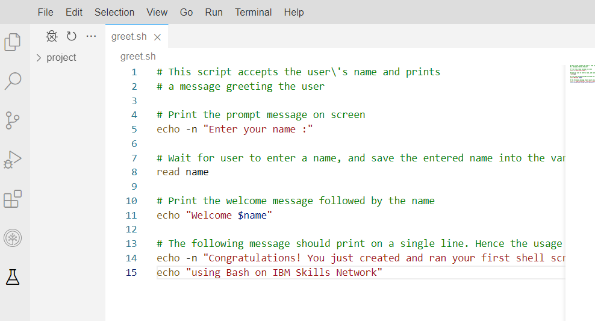
```
1.2. Execute the script
```
theia@theia-lemai0509200:/home/project$ ls -l greet.sh
-rw-r--r-- 1 theia users 522 Sep  8 04:00 greet.sh
theia@theia-lemai0509200:/home/project$ bash greet.sh
Enter your name :Mai
Welcome Mai
Congratulations! You just created and ran your first shell script using Bash on IBM Skills Network
```
* Ex2: Using a shebang line

2.1. Find the path to the interpreter
```
theia@theia-lemai0509200:/home/project$ which bash
/bin/bash
```
2.2. Edit the script `greet.sh` and add the shebang line to the script
```
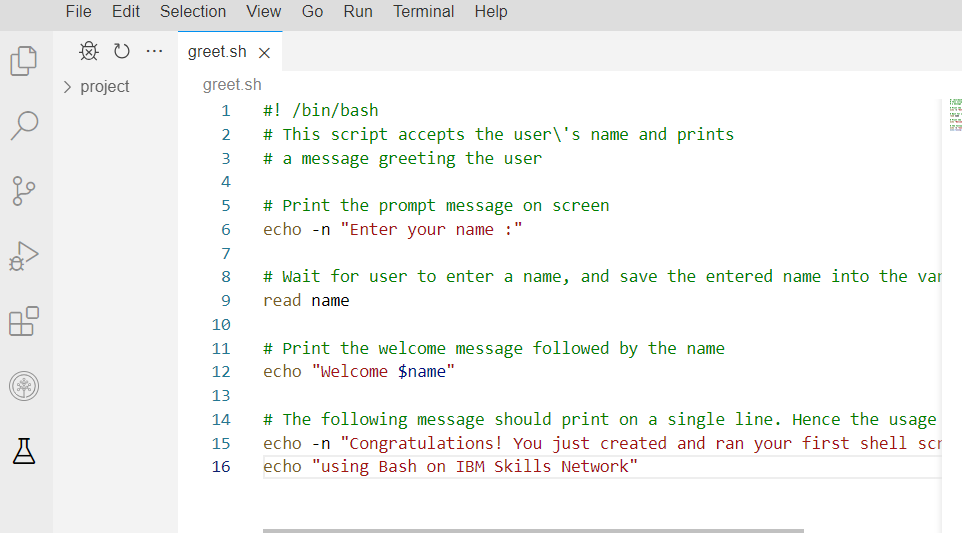
```
2.3. Check the permissions of the script
```
theia@theia-lemai0509200:/home/project$ ls -l greet.sh
-rw-r--r-- 1 theia users 535 Sep  8 04:06 greet.sh
theia@theia-lemai0509200:/home/project$ chmod u+x greet.sh
theia@theia-lemai0509200:/home/project$ ls -l greet.sh
-rwxr--r-- 1 theia users 535 Sep  8 04:06 greet.sh
```
2.4. Execute the script.
```
theia@theia-lemai0509200:/home/project$ ./greet.sh
Enter your name :Mai
Welcome Mai
Congratulations! You just created and ran your first shell script using Bash on IBM Skills Network
```
* Practice exercises

1. Create a script named `greetnew.sh` that takes the first and last names of the user, saves them in corresponding variables `firstname` and `lastname`, and prints a welcome message, such as `"Hello <firstname> <lastname>".`
```
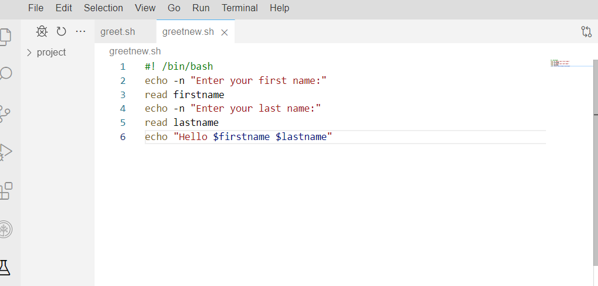
theia@theia-lemai0509200:/home/project$ ls
greetnew.sh  greet.sh
theia@theia-lemai0509200:/home/project$ ls -l greetnew.sh
-rw-r--r-- 1 theia users 140 Sep  8 04:12 greetnew.sh
theia@theia-lemai0509200:/home/project$ chmod u+x greetnew.sh
theia@theia-lemai0509200:/home/project$ ./greetnew.sh
Enter your first name:Mai
Enter your last name:Thieu
Hello Mai Thieu
```

# Advanced Bash Scripting
* Ex1: Using conditional statements and logical operators

1.1. Create a new Bash script
```
theia@theia-lemai0509200:/home/project$ echo '#!/bin/bash' > conditional_script.sh
theia@theia-lemai0509200:/home/project$ ls
conditional_script.sh
theia@theia-lemai0509200:/home/project$ ls -l conditional_script.sh
-rw-r--r-- 1 theia users 12 Sep  8 04:50 conditional_script.sh
theia@theia-lemai0509200:/home/project$ chmod u+x conditional_script.sh 
theia@theia-lemai0509200:/home/project$ ls -l conditional_script.sh
-rwxr--r-- 1 theia users 12 Sep  8 04:50 conditional_script.sh
```
1.2. Query the user and store their response
```
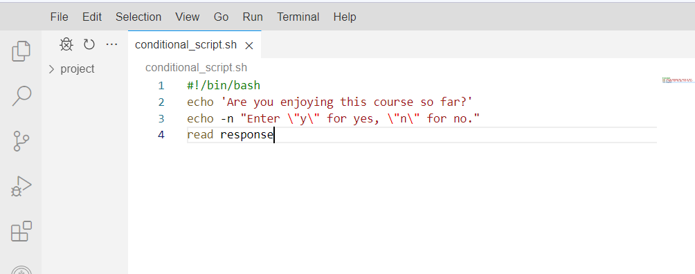
theia@theia-lemai0509200:/home/project$ ./conditional_script.sh 
Are you enjoying this course so far?
Enter "y" for yes, "n" for no.y
```
1.3. Use a conditional block to select a response for the user
```
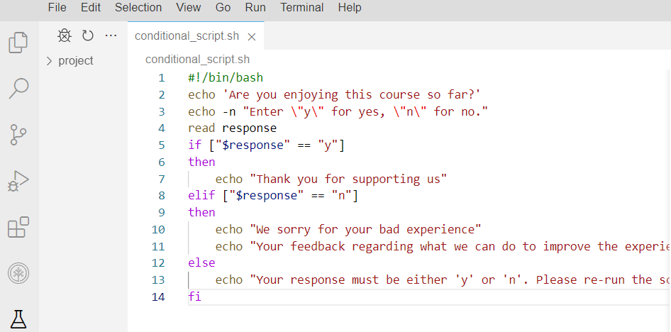
theia@theia-lemai0509200:/home/project$ ./conditional_script.sh 
Are you enjoying this course so far?
Enter "y" for yes, "n" for noy
I'm pleased to hear you are enjoying the course!
Your feedback regarding what you have been enjoying would be most welcome!
theia@theia-lemai0509200:/home/project$ ./conditional_script.sh 
Are you enjoying this course so far?
Enter "y" for yes, "n" for no.y
Thank you for supporting us
theia@theia-lemai0509200:/home/project$ ./conditional_script.sh 
Are you enjoying this course so far?
Enter "y" for yes, "n" for no.n
We sorry for your bad experience
Your feedback regarding what we can do to improve the experience
theia@theia-lemai0509200:/home/project$ ./conditional_script.sh 
Are you enjoying this course so far?
Enter "y" for yes, "n" for no.k
Your response must be either 'y' or 'n'. Please re-run the script
```
* Ex2: Performing basic mathematical calculations and numerical logical comparisons

2.1. Create a Bash script
```
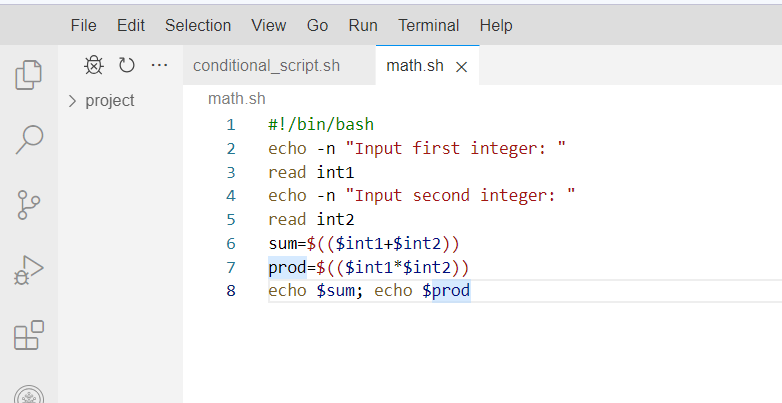
theia@theia-lemai0509200:/home/project$ ./math.sh
Input first integer: 5
Input second integer: 9
14
45
```
2.2. Add logic to your script
```
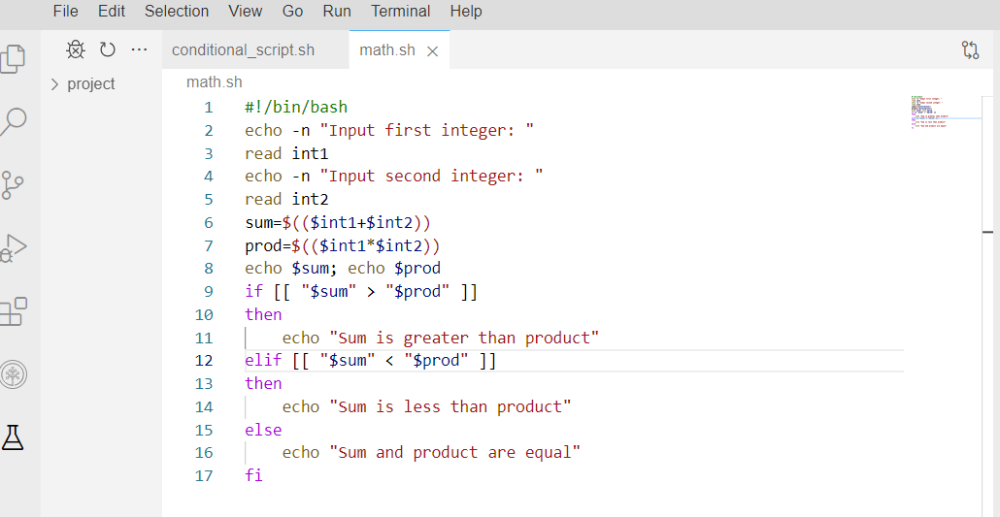
theia@theia-lemai0509200:/home/project$ ./math.sh
Input first integer: 5
Input second integer: 9
14
45
Sum is less than product
```
* Ex3: Using arrays for storing and accessing data within for loops

3.1. Download a CSV file to your current working directory
```
theia@theia-lemai0509200:/home/project$ wget https://cf-courses-data.s3.us.cloud-object-storage.appdomain.cloud/IBM-LX0117EN-SkillsNetwork/labs/M3/L2/arrays_table.csv
--2023-09-08 05:13:52--  https://cf-courses-data.s3.us.cloud-object-storage.appdomain.cloud/IBM-LX0117EN-SkillsNetwork/labs/M3/L2/arrays_table.csv
Resolving cf-courses-data.s3.us.cloud-object-storage.appdomain.cloud (cf-courses-data.s3.us.cloud-object-storage.appdomain.cloud)... 169.63.118.104
Connecting to cf-courses-data.s3.us.cloud-object-storage.appdomain.cloud (cf-courses-data.s3.us.cloud-object-storage.appdomain.cloud)|169.63.118.104|:443... connected.
HTTP request sent, awaiting response... 200 OK
Length: 54 [text/csv]
Saving to: ‘arrays_table.csv’

arrays_table.csv     100%[======================>]      54  --.-KB/s    in 0s      

2023-09-08 05:13:52 (10.1 MB/s) -
```

3.2. Display the CSV file to understand what it looks like
```
theia@theia-lemai0509200:/home/project$ cat arrays_table.csv 
column_0,column_1,column_2
1,2,3
4,5,6
7,8,9
10,11,12
```
3.3. Create a Bash script that parses table columns into 3 arrays
```
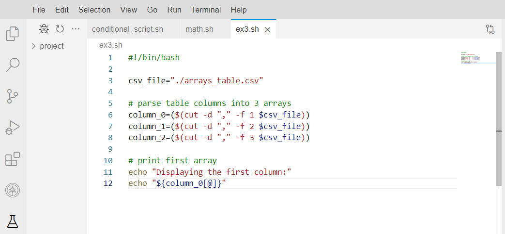
theia@theia-lemai0509200:/home/project$ ./ex3.sh
Displaying the first column:
column_0 1 4 7 10
```
3.4. Create a new array as the difference of the third and second columns.
```
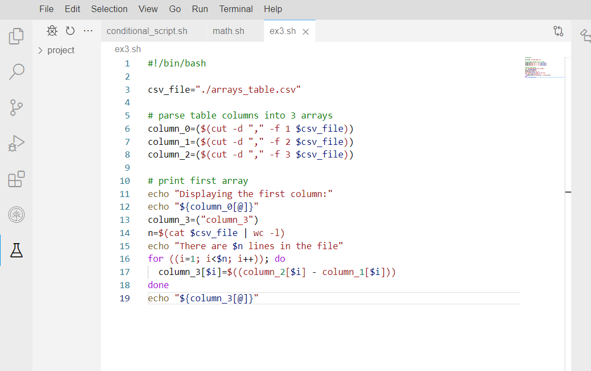
theia@theia-lemai0509200:/home/project$ ./ex3.sh
Displaying the first column:
column_0 1 4 7 10
There are 5 lines in the file
column_3 1 1 1 1
```
3.5. Create a report by combining your new column with the source table
```
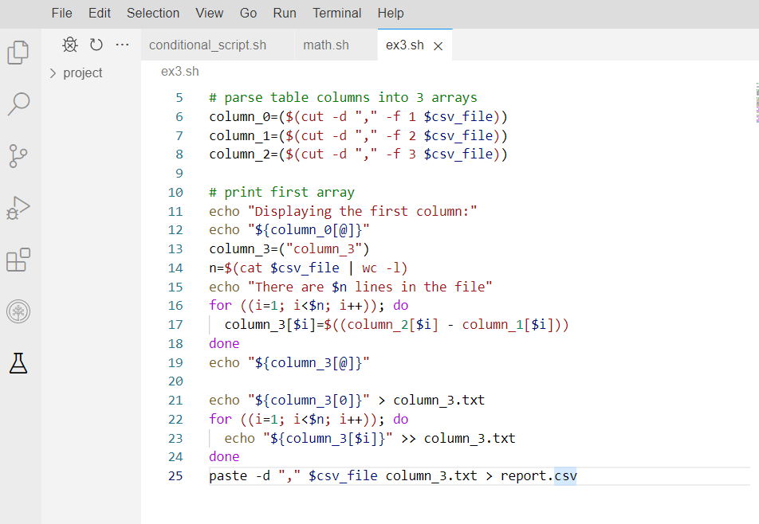
theia@theia-lemai0509200:/home/project$ ls
45   arrays_table.csv  conditional_script.sh  math.sh
45]  column_3.txt      ex3.sh                 report.csv
theia@theia-lemai0509200:/home/project$ cat report.csv
column_0,column_1,column_2,column_3
1,2,3,1
4,5,6,1
7,8,9,1
10,11,12,1
```
# Scheduling job using Crontab
* Ex1: Understand crondtab

* Ex2: List cron jobs
```
theia@theia-lemai0509200:/home/project$ crontab -l 
no crontab for theia
```
* Ex3: Add a job in the crontab file

3.1. Add a job to crontab
```
theia@theia-lemai0509200:/home/project$ crontab -e
no crontab for theia - using an empty one
crontab: installing new crontab
theia@theia-lemai0509200:/home/project$ crontab -l
# Edit this file to introduce tasks to be run by cron.
# 
# Each task to run has to be defined through a single line
# indicating with different fields when the task will be run
# and what command to run for the task
# 
# To define the time you can provide concrete values for
# minute (m), hour (h), day of month (dom), month (mon),
# and day of week (dow) or use '*' in these fields (for 'any').# 
# Notice that tasks will be started based on the cron's system
# daemon's notion of time and timezones.
# 
# Output of the crontab jobs (including errors) is sent through
# email to the user the crontab file belongs to (unless redirected).
# 
# For example, you can run a backup of all your user accounts
# at 5 a.m every week with:
# 0 5 * * 1 tar -zcf /var/backups/home.tgz /home/
# 
# For more information see the manual pages of crontab(5) and cron(8)
# 
# m h  dom mon dow   command
0 21 * * * echo "Welcome to cron" >> /tmp/echo.txt
```
3.2. Schedule a shell script
```
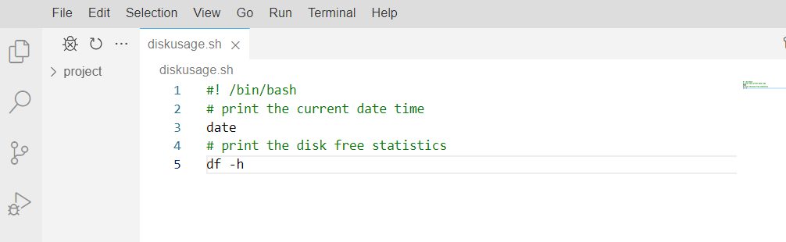
theia@theia-lemai0509200:/home/project$ chmod u+x diskusage.sh
theia@theia-lemai0509200:/home/project$ ./diskusage.sh 
Fri Sep  8 09:26:17 EDT 2023
Filesystem      Size  Used Avail Use% Mounted on
overlay          98G   53G   41G  57% /
tmpfs            64M     0   64M   0% /dev
tmpfs            16G     0   16G   0% /sys/fs/cgroup
/dev/vda2        98G   53G   41G  57% /etc/hosts
shm              64M     0   64M   0% /dev/shm
tmpfs            28G   16K   28G   1% /run/secrets/kubernetes.io/serviceaccount
tmpfs            16G     0   16G   0% /proc/acpi
tmpfs            16G     0   16G   0% /proc/scsi
tmpfs            16G     0   16G   0% /sys/firmware
theia@theia-lemai0509200:/home/project$ crontab -e
crontab: installing new crontab
theia@theia-lemai0509200:/home/project$ crontab -l
# Edit this file to introduce tasks to be run by cron.
# 
# Each task to run has to be defined through a single line
# indicating with different fields when the task will be run
# and what command to run for the task
# 
# To define the time you can provide concrete values for
# minute (m), hour (h), day of month (dom), month (mon),
# and day of week (dow) or use '*' in these fields (for 'any').# 
# Notice that tasks will be started based on the cron's system
# daemon's notion of time and timezones.
# 
# Output of the crontab jobs (including errors) is sent through
# email to the user the crontab file belongs to (unless redirected).
# 
# For example, you can run a backup of all your user accounts
# at 5 a.m every week with:
# 0 5 * * 1 tar -zcf /var/backups/home.tgz /home/
# 
# For more information see the manual pages of crontab(5) and cron(8)
# 
# m h  dom mon dow   command
0 21 * * * echo "Welcome to cron" >> /tmp/echo.txt
0 0 * * * /home/project/diskusage.sh >>/home/project/diskusage.log
```
* Ex4 - Remove the current crontab
```
theia@theia-lemai0509200:/home/project$ crontab -r
theia@theia-lemai0509200:/home/project$ crontab -l
no crontab for theia
```
* Practice exercises
1. Create a cron job that runs the task `date >> /tmp/everymin.txt` every minute.
```
theia@theia-lemai0509200:/home/project$ crontab -e
crontab: installing new crontab
theia@theia-lemai0509200:/home/project$ crontab -l
# Edit this file to introduce tasks to be run by cron.
# 
# Each task to run has to be defined through a single line
# indicating with different fields when the task will be run
# and what command to run for the task
# 
# To define the time you can provide concrete values for
# minute (m), hour (h), day of month (dom), month (mon),
# and day of week (dow) or use '*' in these fields (for 'any').# 
# Notice that tasks will be started based on the cron's system
# daemon's notion of time and timezones.
# 
# Output of the crontab jobs (including errors) is sent through
# email to the user the crontab file belongs to (unless redirected).
# 
# For example, you can run a backup of all your user accounts
# at 5 a.m every week with:
# 0 5 * * 1 tar -zcf /var/backups/home.tgz /home/
# 
# For more information see the manual pages of crontab(5) and cron(8)
# 
# m h  dom mon dow   command
0 21 * * * echo "Welcome to cron" >> /tmp/echo.txt
0 0 * * * /home/project/diskusage.sh >>/home/project/diskusage.log
theia@theia-lemai0509200:/home/project$ crontab -r
theia@theia-lemai0509200:/home/project$ crontab -l
no crontab for theia
theia@theia-lemai0509200:/home/project$ crontab -e
no crontab for theia - using an empty one
crontab: installing new crontab
theia@theia-lemai0509200:/home/project$ crontab -l
# Edit this file to introduce tasks to be run by cron.
# 
# Each task to run has to be defined through a single line
# indicating with different fields when the task will be run
# and what command to run for the task
# 
# To define the time you can provide concrete values for
# minute (m), hour (h), day of month (dom), month (mon),
# and day of week (dow) or use '*' in these fields (for 'any').# 
# Notice that tasks will be started based on the cron's system
# daemon's notion of time and timezones.
# 
# Output of the crontab jobs (including errors) is sent through
# email to the user the crontab file belongs to (unless redirected).
# 
# For example, you can run a backup of all your user accounts
# at 5 a.m every week with:
# 0 5 * * 1 tar -zcf /var/backups/home.tgz /home/
# 
# For more information see the manual pages of crontab(5) and cron(8)
# 
# m h  dom mon dow   command
* * * * * date >> /tmp/everymin.txt
```
