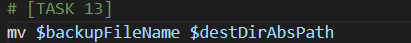

* Task 0:
```
theia@theiadocker-lemai0509200:/home/project$ wget https://cf-courses-data.s3.us.cloud-object-storage.appdomain.cloud/IBM-LX0117EN-SkillsNetwork/labs/Final%20Project/backup.sh
--2023-09-11 22:57:00--  https://cf-courses-data.s3.us.cloud-object-storage.appdomain.cloud/IBM-LX0117EN-SkillsNetwork/labs/Final%20Project/backup.sh
Resolving cf-courses-data.s3.us.cloud-object-storage.appdomain.cloud (cf-courses-data.s3.us.cloud-object-storage.appdomain.cloud)... 169.63.118.104
Connecting to cf-courses-data.s3.us.cloud-object-storage.appdomain.cloud (cf-courses-data.s3.us.cloud-object-storage.appdomain.cloud)|169.63.118.104|:443... connected.
HTTP request sent, awaiting response... 200 OK
Length: 1071 (1.0K) [text/x-sh]
Saving to: ‘backup.sh’

backup.sh               100%[===============================>]   1.05K  --.-KB/s    in 0s      

2023-09-11 22:57:00 (132 MB/s) - ‘backup.sh’ saved [1071/1071]
```
* Task 1: Navigate to `# [TASK 1]` in the code.

Set two variables equal to the values of the first and second command line arguments, as follows:

Set `targetDirectory` to the first command line argument
Set `destinationDirectory` to the second command line argument
This task is meant to help with code readability.
```

```
* Task 2: Display the values of the two command line arguments in the terminal.
```

```
* Task 3: Define a variable called `currentTS` as the current timestamp, expressed in seconds.
```

```
* Task 4: Define a variable called `backupFileName` to store the name of the archived and compressed backup file that the script will create.
```

```
* Task 5: Define a variable called `origAbsPath` with the absolute path of the current directory as the variable's value
```

```
* Task 6: Define a variable called `destAbsPath` whose value equals the absolute path of the destination directory.
```

```
* Task 7: Change directories from the current working directory to the target directory `targetDirectory`.
```

```
* Task 8: You need to find files that have been updated within the past 24 hours. This means you need to find all files whose last-modified date was 24 hours ago or less.
```

```
* Task 9: Within the `$()` expression inside the for loop, write a command that will return all files and directories in the current folder.
```

```
* Task 10: Inside the for loop, you want to check whether the `$file` was modified within the last 24 hours.
```

```
* Task 11: In the if-then statement, add the `$file `that was updated in the past 24-hours to the toBackup array.
```

```
* Task 12:
```

```
* Task 13:
```

```
* Task 15: Save the backup.sh file you're working on and make it executable.
```
theia@theiadocker-lemai0509200:/home/project$ ls
backup.sh
theia@theiadocker-lemai0509200:/home/project$ ls -l backup.sh 
-rw-r--r-- 1 theia users 1406 Sep 11 23:38 backup.sh
theia@theiadocker-lemai0509200:/home/project$ chmod u+x backup.sh 
theia@theiadocker-lemai0509200:/home/project$ ls -l backup.sh 
-rwxr--r-- 1 theia users 1406 Sep 11 23:38 backup.sh
```
* Task 16:

1. Download
```
theia@theiadocker-lemai0509200:/home/project$ wget https://cf-courses-data.s3.us.cloud-object-storage.appdomain.cloud/IBM-LX0117EN-SkillsNetwork/labs/Final%20Project/important-documents.zip
--2023-09-11 23:40:28--  https://cf-courses-data.s3.us.cloud-object-storage.appdomain.cloud/IBM-LX0117EN-SkillsNetwork/labs/Final%20Project/important-documents.zip
Resolving cf-courses-data.s3.us.cloud-object-storage.appdomain.cloud (cf-courses-data.s3.us.cloud-object-storage.appdomain.cloud)... 169.63.118.104
Connecting to cf-courses-data.s3.us.cloud-object-storage.appdomain.cloud (cf-courses-data.s3.us.cloud-object-storage.appdomain.cloud)|169.63.118.104|:443... connected.
HTTP request sent, awaiting response... 200 OK
Length: 4995 (4.9K) [application/zip]
Saving to: ‘important-documents.zip’

important-documents.zip 100%[===============================>]   4.88K  --.-KB/s    in 0s      

2023-09-11 23:40:28 (499 MB/s) - ‘important-documents.zip’ saved [4995/4995]
```
2. Unzip
```
theia@theiadocker-lemai0509200:/home/project$ unzip -DDo important-documents.zip
Archive:  important-documents.zip
   creating: important-documents/
  inflating: important-documents/zop.txt  
  inflating: important-documents/ana.txt  
  inflating: important-documents/doi.txt  
theia@theiadocker-lemai0509200:/home/project$ ls
backup.sh  important-documents  important-documents.zip
```
3. Update file's last modified date to now:
```
theia@theiadocker-lemai0509200:/home/project$ touch important-documents/*
theia@theiadocker-lemai0509200:/home/project$ date -r important-documents
Mon Sep 11 23:41:01 EDT 2023
```
4. Test script
```
theia@theiadocker-lemai0509200:/home/project$ ./backup.sh important-documents .
targetDirectory is important-documents
destinationDirectory is .
ana.txt
doi.txt
zop.txt
mv: 'backup-1694491380.tar.gz' and './backup-1694491380.tar.gz' are the same file

```
* Task 17:
```
theia@theiadocker-lemai0509200:/home/project$ crontab -e
no crontab for theia - using an empty one                                     crontab: installing new crontab_context
"/tmp/crontab.dwzZMM/crontab":22: bad minute
errors in crontab file, can't install.
Do you want to retry the same edit? (y/n) y
crontab: installing new crontab
"/tmp/crontab.dwzZMM/crontab":22: bad minute
errors in crontab file, can't install.
Do you want to retry the same edit? (y/n) y
Use "fg" to return to nano.

[1]+  Stopped                 crontab -e
theia@theiadocker-lemai0509200:/home/project$ crontab -e
no crontab for theia - using an empty one
crontab: installing new crontab
theia@theiadocker-lemai0509200:/home/project$ crontab -l
# Edit this file to introduce tasks to be run by cron.
# 
# Each task to run has to be defined through a single line
# indicating with different fields when the task will be run
# and what command to run for the task
# 
# To define the time you can provide concrete values for
# minute (m), hour (h), day of month (dom), month (mon),
# and day of week (dow) or use '*' in these fields (for 'any').# 
# Notice that tasks will be started based on the cron's system
# daemon's notion of time and timezones.
# 
# Output of the crontab jobs (including errors) is sent through
# email to the user the crontab file belongs to (unless redirected).
# 
# For example, you can run a backup of all your user accounts
# at 5 a.m every week with:
# 0 5 * * 1 tar -zcf /var/backups/home.tgz /home/
# 
# For more information see the manual pages of crontab(5) and cron(8)
# 
# m h  dom mon dow   command
*/1 * * * * /usr/local/bin/backup.sh /home/project/important-documents /home/project
```