* Ex1: Initialize your weather report log file

1.1 Create a text file called `rx_poc.log`
```
theia@theia-lemai0509200:/home/project$ touch rx_poc.log
theia@theia-lemai0509200:/home/project$ ls
diskusage.sh  rx_poc.log
```
1.2 Add a header to your weather report
```
theia@theia-lemai0509200:/home/project$ echo -e "year\tmonth\tday\thour\tobs_tmp\tfc_temp">rx_poc.log
theia@theia-lemai0509200:/home/project$ cat rx_poc.log 
year    month   day     hour    obs_tmp fc_temp
```
* Ex2 - Download the raw weather data

2.1. Create a text file called `rx_poc.sh` and make it an executable Bash script
```
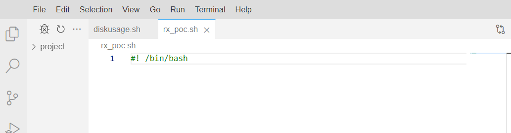
theia@theia-lemai0509200:/home/project$ ls
diskusage.sh  rx_poc.log  rx_poc.sh
theia@theia-lemai0509200:/home/project$ ls -l rx_poc.sh
-rw-r--r-- 1 theia users 12 Sep  8 09:54 rx_poc.sh
theia@theia-lemai0509200:/home/project$ chmod u+x rx_poc.sh
theia@theia-lemai0509200:/home/project$ ls -l rx_poc.sh
-rwxr--r-- 1 theia users 12 Sep  8 09:54 rx_poc.sh
```
2.2 Edit rx_poc.sh to download today's weather report from wttr.in
```
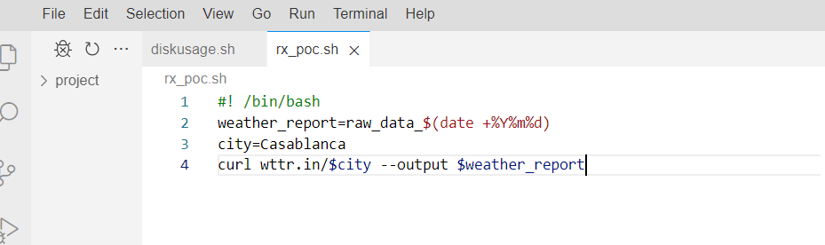
```
* Ex3: Extract and load the required data

3.1. Edit `rx_poc.sh` to extract the required data from the raw data file and assign them to variables `obs_tmp` and `fc_temp`
```
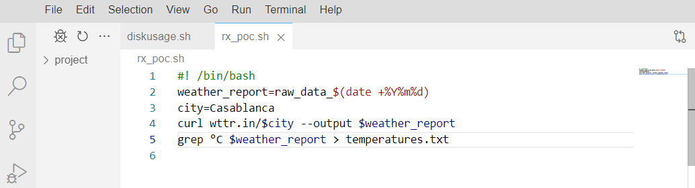
theia@theia-lemai0509200:/home/project$ ./rx_poc.sh
  % Total    % Received % Xferd  Average Speed   Time    Time     Time  Current
                                 Dload  Upload   Total   Spent    Left  Speed
100  9147  100  9147    0     0  20326      0 --:--:-- --:--:-- --:--:-- 20326
theia@theia-lemai0509200:/home/project$ cat temperatures.txt
   _ /"".-.     +26(27) °C     
│      .-.      +24(26) °C     │      .-.      27 °C          │      .-.      +25(26) °C     │      .-.      +23(25) °C     │
│      .-.      +24(25) °C     │      .-.      +26(27) °C     │      .-.      +24(26) °C     │      .-.      +23(25) °C     │
│      .-.      +23(25) °C     │      .-.      +25(27) °C     │      .-.      +24(26) °C     │      .-.      +23(25) °C     │
```
3.1.1. Extract the current temperature, and store it in a shell variable called `obs_tmp`
```
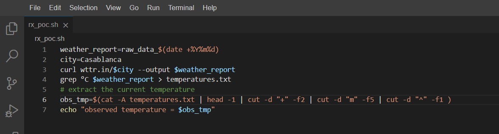
theia@theia-lemai0509200:/home/project$ ./rx_poc.sh
  % Total    % Received % Xferd  Average Speed   Time    Time     Time  Current
                                 Dload  Upload   Total   Spent    Left  Speed
100  9171  100  9171    0     0  40223      0 --:--:-- --:--:-- --:--:-- 40223
observed temperature = 21
```
3.1.2. Extract tomorrow's temperature forecast for noon, and store it in a shell variable called `fc_tmp`
```
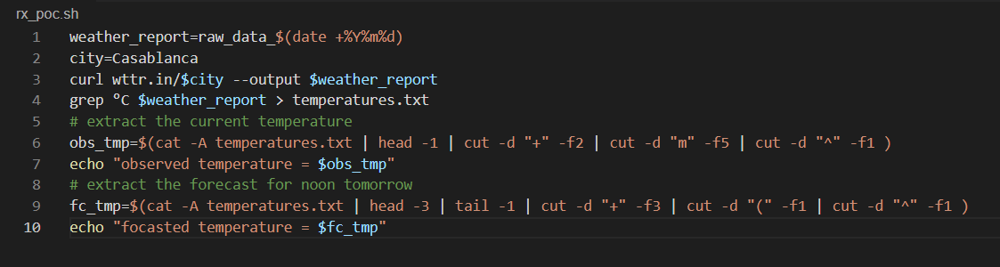
theia@theia-lemai0509200:/home/project$ ./rx_poc.sh
  % Total    % Received % Xferd  Average Speed   Time    Time     Time  Current
                                 Dload  Upload   Total   Spent    Left  Speed
100  9171  100  9171    0     0  20890      0 --:--:-- --:--:-- --:--:-- 20843
observed temperature = 21
focasted temperature = 25
```
3.2. Store the current hour, day, month, and year in corresponding shell variables
```
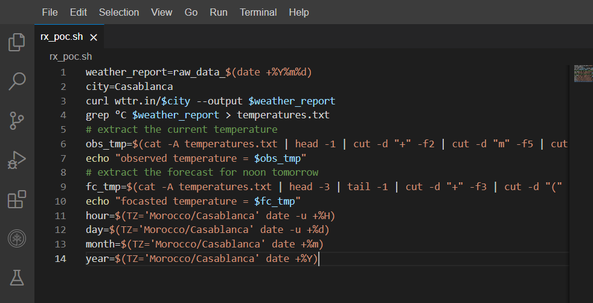
```
3.3. Merge the fields into a tab-delimited record, corresponding to a single row in Table 1
```
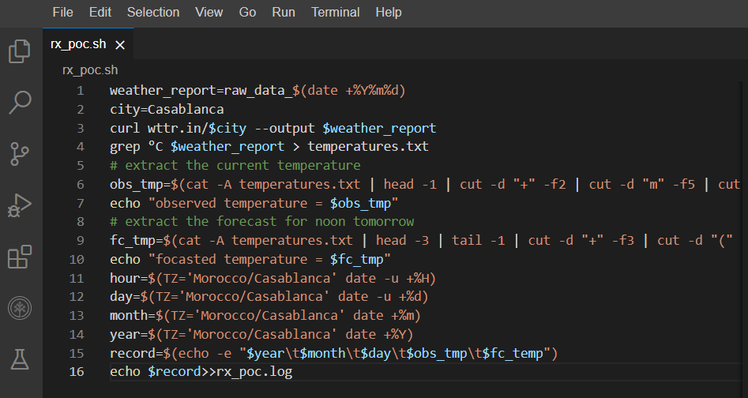
theia@theia-lemai0509200:/home/project$ ./rx_poc.sh
  % Total    % Received % Xferd  Average Speed   Time    Time     Time  Current
                                 Dload  Upload   Total   Spent    Left  Speed
100  9171  100  9171    0     0  21835      0 --:--:-- --:--:-- --:--:-- 21835
observed temperature = 21
focasted temperature = 25
theia@theia-lemai0509200:/home/project$ cat rx_poc.log
year    month   day     obs_tmp fc_tmp
2023 09 12 21 25
```
* Ex4 - Schedule your Bash script `rx_poc.sh` to run every day at noon local time

4.1. Determine what time of day to run your script
```
theia@theia-lemai0509200:/home/project$ date
Mon Sep 11 21:30:40 EDT 2023
theia@theia-lemai0509200:/home/project$ date -u
Tue Sep 12 01:30:49 UTC 2023
```
4.2 Create a cron job that runs your script
```
theia@theia-lemai0509200:/home/project$ crontab -e
no crontab for theia - using an empty one
crontab: installing new crontab
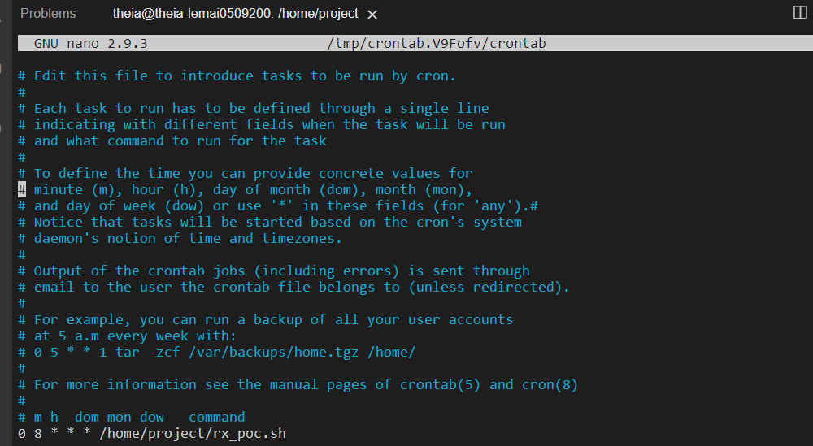
```
* Ex5: Create a script to report historical forecasting accuracy
```
theia@theia-lemai0509200:/home/project$ touch historical_fc_accuracy.tsv
theia@theia-lemai0509200:/home/project$ echo -e "year\tmonth\tday\tobs_tmp\tfc_temp\taccuracy\taccuracy_range" > historical_fc_accuracy.tsv
theia@theia-lemai0509200:/home/project$ cat historical_fc_accuracy.tsv 
year    month   day     obs_tmp fc_temp accuracy        accuracy_range
```
```
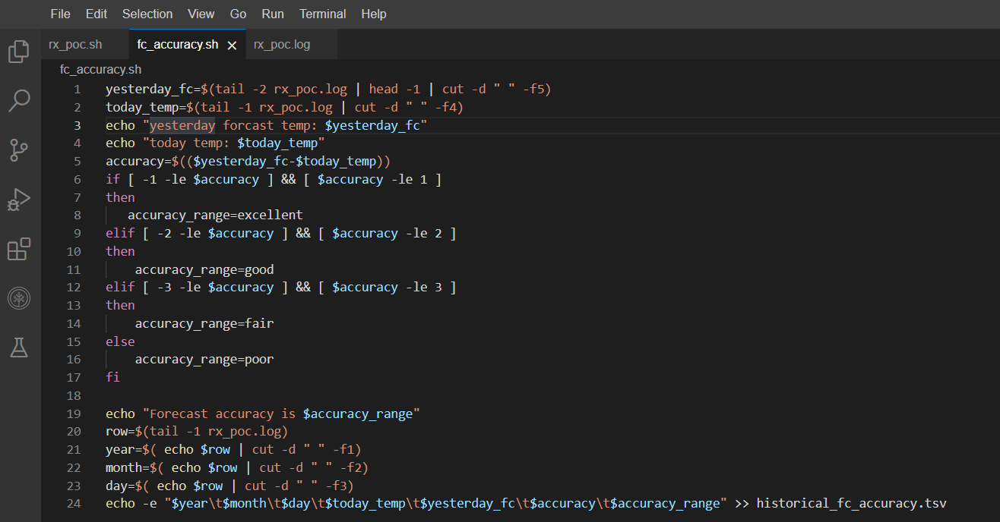
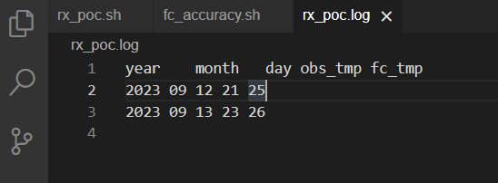
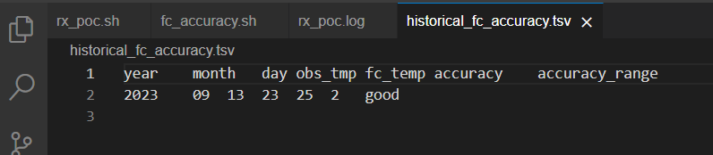
```
* Ex6: Create a script to report weekly statistics of historical forecasting accuracy

6.1. Download the synthetic historical forecasting accuracy dataset
```
theia@theia-lemai0509200:/home/project$ wget https://cf-courses-data.s3.us.cloud-object-storage.appdomain.cloud/IBMSkillsNetwork-LX0117EN-Coursera/labs/synthetic_historical_fc_accuracy.tsv
--2023-09-11 21:58:36--  https://cf-courses-data.s3.us.cloud-object-storage.appdomain.cloud/IBMSkillsNetwork-LX0117EN-Coursera/labs/synthetic_historical_fc_accuracy.tsv
Resolving cf-courses-data.s3.us.cloud-object-storage.appdomain.cloud (cf-courses-data.s3.us.cloud-object-storage.appdomain.cloud)... 169.63.118.104
Connecting to cf-courses-data.s3.us.cloud-object-storage.appdomain.cloud (cf-courses-data.s3.us.cloud-object-storage.appdomain.cloud)|169.63.118.104|:443... connected.
HTTP request sent, awaiting response... 200 OK
Length: 263 [text/tab-separated-values]
Saving to: ‘synthetic_historical_fc_accuracy.tsv’

synthetic_historical_ 100%[========================>]     263  --.-KB/s    in 0s      

2023-09-11 21:58:36 (30.2 MB/s) - ‘synthetic_historical_fc_accuracy.tsv’ saved [263/263]
theia@theia-lemai0509200:/home/project$ cat synthetic_historical_fc_accuracy.tsv 
year    month   day     obs_tmp fc_temp accuracy        accuracy_range
2023    05      28      20      22      -2      good
2023    05      29      21      26      -5      poor
2023    05      30      24      25      -1      good
2023    05      31      20      22      -2      excellent
2023    06      1       24      20      4       poor
2023    06      2       20      22      -2      good
2023    06      3       25      25      0       excellent
2023    06      4       27      26      1       excellent
```
6.2. Load the historical accuracies into an array covering the last week of data
```
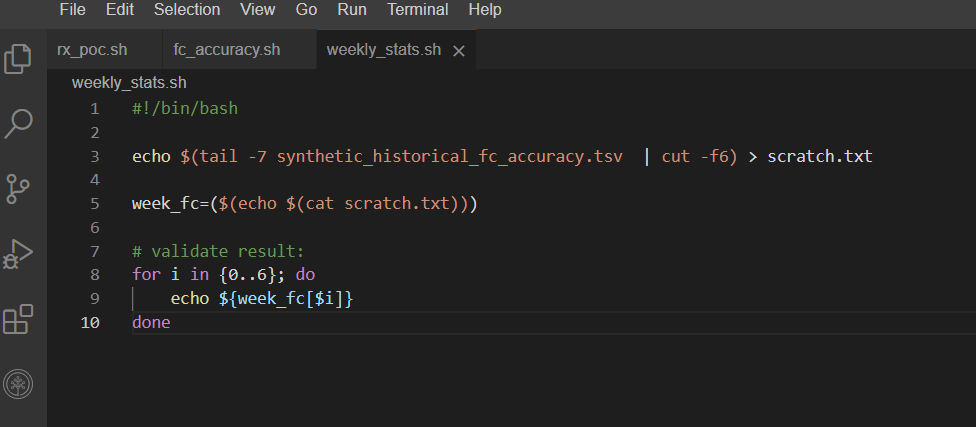
theia@theia-lemai0509200:/home/project$ ./weekly_stats.sh 
-5
-1
-2
4
-2
0
1
```
6.3. Display the minimum and maximum absolute forecasting errors for the week
```
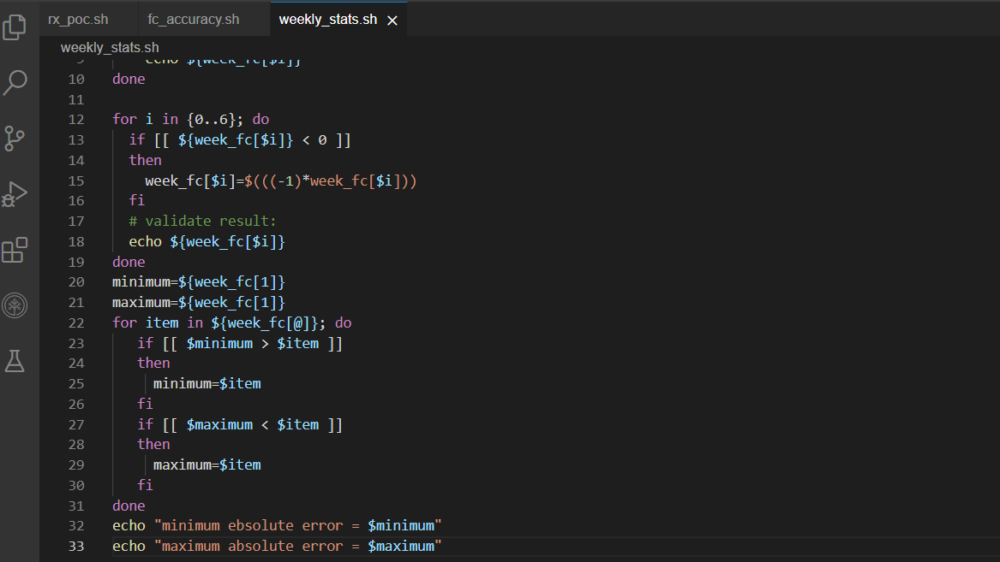
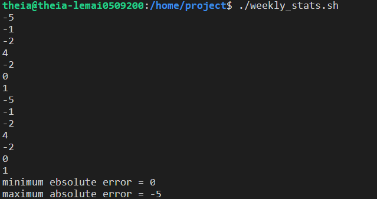
```
